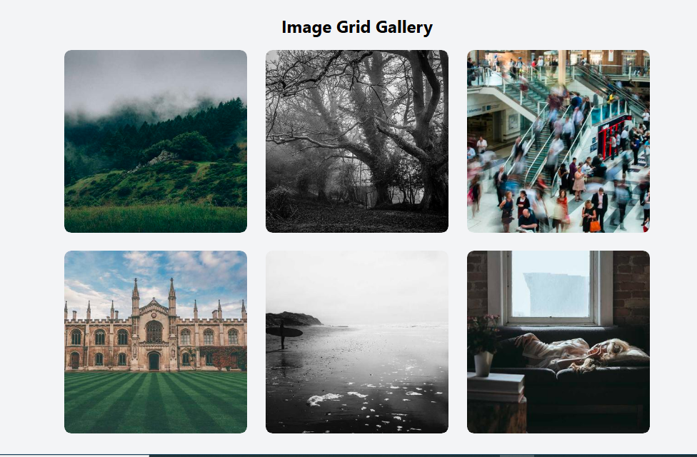
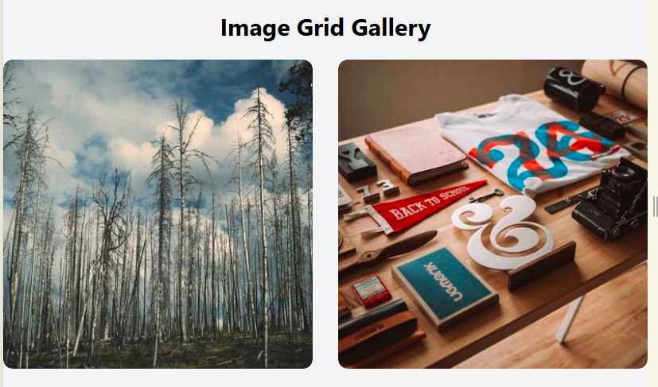
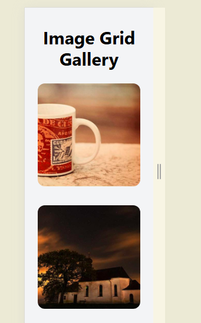

# 📸 Tailwind CSS Image Grid Gallery

This project is a responsive 6-image **grid gallery** built using **Tailwind CSS.**
It showcases a clean layout with hover zoom effects, making it perfect for portfolios, photo galleries, or creative projects.

# Features

**Responsive grid layout**

1 column on small screens

2 columns on medium screens

3 columns on large screens

**Hover zoom effect:** Each image slightly zooms when hovered.

**Rounded images & cards:** Smooth rounded corners for a modern look.

**Professional spacing:** Clean padding, margin, and gap utilities.

**Favicon support:** Includes a camera icon favicon.

# Technologies Used

**Tailwind CSS** (via CDN)

**HTML5**

# How to Run the Project

Clone or download the project.

Open index.html in a modern browser.

Hover over images to see the zoom effect.

Resize the browser window to see responsive behavior.

# Tailwind Classes Used

**Grid layout:** grid grid-cols-1 md:grid-cols-2 lg:grid-cols-3 gap-8

**Rounded corners:** rounded-xl

**Hover zoom effect:** group-hover:scale-110 transition-transform duration-300

**Object fit for images:** object-cover

**Cursor pointer:** cursor-pointer

**Padding & spacing:** py-8 mb-6

# Image Sources

All placeholder images are from Picsum Photos
.

# Notes

**overflow-hidden** keeps images inside their card when zooming.

**group + group-hover** apply hover effects to children when the parent is hovered.

**object-cover** ensures images fill the container without stretching.

# Recommended Improvements

Add image captions that appear on hover.

Implement a lightbox effect for full-size viewing.

Replace placeholders with your own images.

Customize spacing, colors, or shadows to match your design style.

# Preview 

**Author : Waleed Arshad Kayani**